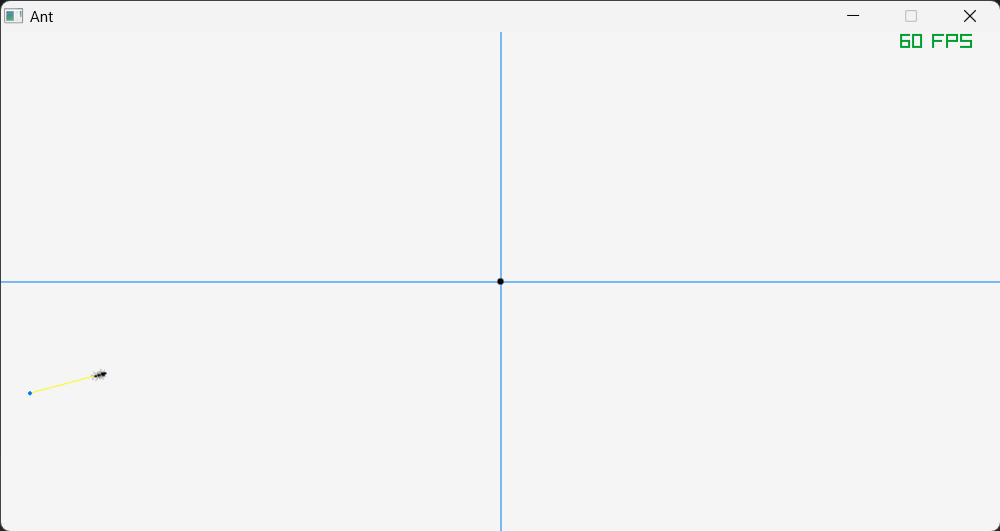
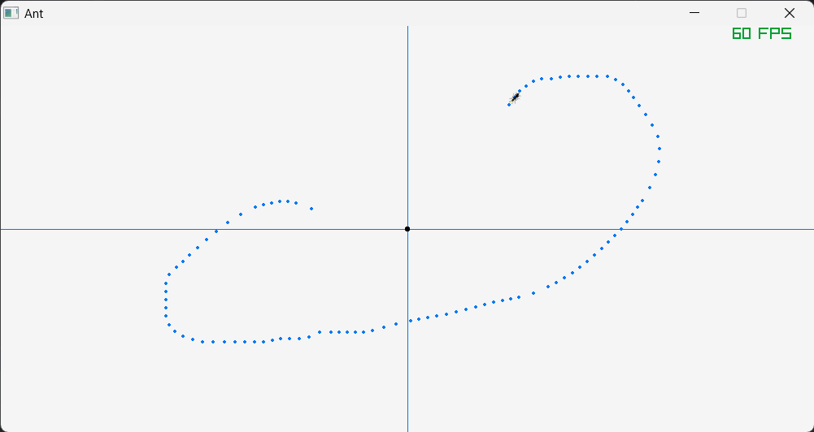
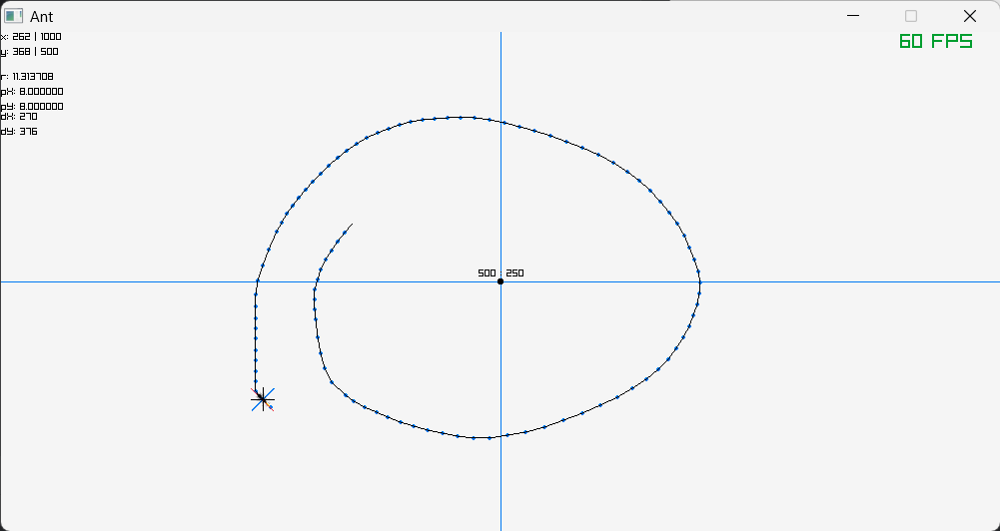

# ant-simulate-prototype

### Hotkey 
- Right mouse click to enter/exit drag mode 
- Left mouse click to place target 
- Hold left mouse to drag 
- Press `R` to reset ants position 
- Press `D` to enable/disable debug mode 
- Press `T` to enable/disable track mode 

Default

Track mode true: 

Both track mode and debug mode set to true
